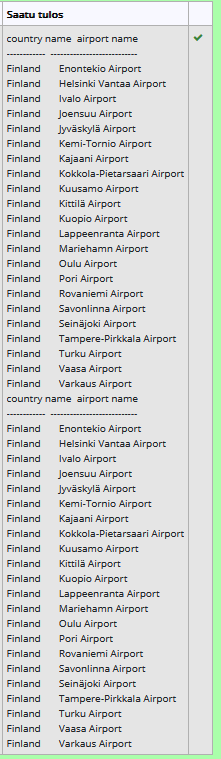
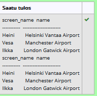
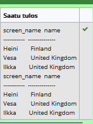
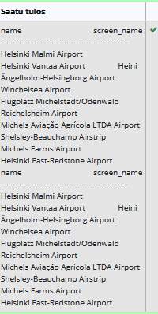
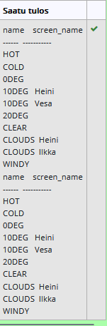
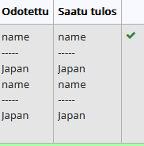
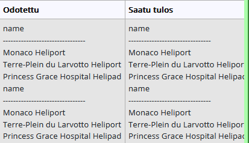
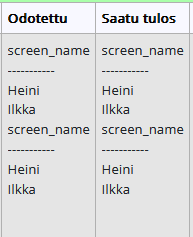
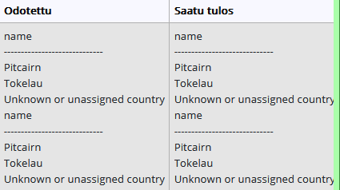

# join harjoitukset:
# tehtävä 1
SELECT country.name as "country name", airport.name as "airport name"
FROM airport inner join country on
airport.iso_country = country.iso_country
WHERE country.name = "Finland"and scheduled_service = "yes" ;

# tehtävä2
SELECT screen_name , airport.name
FROM game inner join airport on 
location = ident;

# tehtävä 3
SELECT screen_name, country.name
FROM game inner join airport on 
location = ident inner join country on
airport.iso_country = country.iso_country;

# tehtava 4
SELECT airport.name, screen_name
FROM airport left join game on 
ident = location
WHERE name like "%Hels%";

# tehtävä 5
SELECT name, screen_name
FROM goal left join goal_reached on 
goal.id = goal_id  left join game
on game.id = game_id;

# Sisäkysely harjoitukset:
# tehtävä 6
select name
from country
where iso_country in(
select iso_country
from airport
where name like "Satsuma%"

);

# tehtävä 7
select name
from airport
where iso_country in(
select iso_country
from country
where name = "Monaco"

);

# tehtävä 8
select screen_name
from game
where id in (
select game_id
from goal_reached
where goal_id in(
select id
from goal
where name = "CLOUDS"
)

);

# tehtävä 9
select name
from country
where iso_country not in (
select iso_country
from airport);

# tehtävä 10
select name
from goal
where id not in (
select goal_id
from goal_reached
where game_id not in (
select id
from game
where screen_name ="Heini"));
